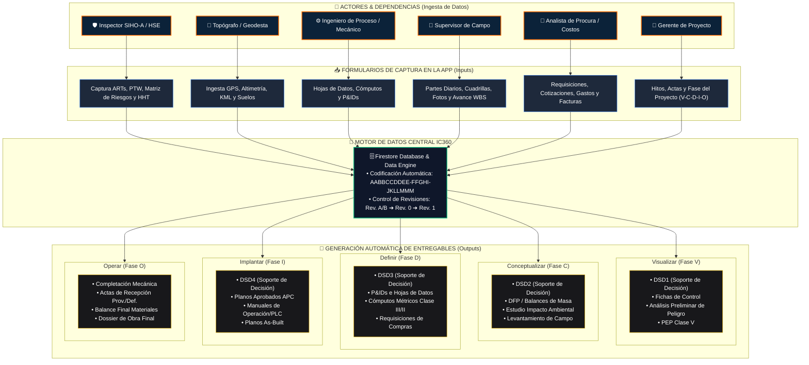

# 🏗️ ARQUITECTURA DE INGESTA & GENERACIÓN DE DOCUMENTOS PDVSA (PIC-01-03-05)

---

## 📊 MATRIZ DE INGESTA VS. DOCUMENTOS SALIDA (PIC-01-03-05)

| Actor / Dependencia | Módulo de Captura en App | Ingesta de Datos (Inputs) | Documentos PIC-01-03-05 Generados (Outputs) |
| :--- | :--- | :--- | :--- |
| **🛡️ Inspector SIHO-A** | `src/pages/SihoPtw.tsx` | Permisos PTW, ART, AST, Charlas, HHT, Incidentes | - **S-01:** Plan de Seguridad y Salud - **APP:** Análisis Preliminar de Peligros - **SIHO-03:** Reportes de Auditorías HSE |
| **📐 Topógrafo / Geodesta** | `src/pages/LogisticsMap.tsx` | Coordenadas GPS, archivos KML/KMZ, Altimetría, Ensayos de Suelos | - **O-01:** Informes de Levantamiento de Campo - **O-03/04:** Planos de Ubicación y Perfiles Longitud |
| **⚙️ Ingeniero de Proceso** | `src/pages/EngineeringTools.tsx` | Bases de Diseño, Presiones, Caudales, Diámetros, Especificaciones | - **P-01:** Hojas de Datos de Procesos - **P-13:** Diagrama de Flujo de Procesos (DFP) - **M-01:** Memorias de Cálculo |
| **🚜 Supervisor Campo** | `src/pages/FieldReports.tsx` | Parte Diario, Asistencia Cuadrillas, Horas Maquinaria, Fotos Evidencia | - **G-02:** Cronograma de Ejecución Real - **G-03:** Informes de Gestión Semanal/Mensual - **G-04:** Registros de Avance Físico |
| **💼 Procura & Costos** | `src/pages/Expenses.tsx` | Cotizaciones, Requisiciones, Facturas, Certificados de Recepción | - **G-05:** Estimados de Costos (Clase V a I) - **PRO-01:** Requisiciones de Materiales y Equipos - **PRO-02:** Evaluación de Ofertas Técnicas |
| **👔 Gerente / Calidad** | `src/pages/Valuations.tsx` | Hitos, Actas, Ensayos NDT Soldadura, Avance Ponderado | - **DSD1 a DSD4:** Documentos Soporte de Decisión - **Q-01:** Planes de Calidad y Puntos de Inspección - **O-01/14:** Actas de Completación Mecánica y Recepción |

---

> [!TIP]
> **Formato de Portada Estandarizado (Anexo A):** Todos los documentos PDF/Word generados por este motor incluyen automáticamente el logo oficial, la estructura de código `AABBCCDDEE-FFGHI-JKLLMMM`, la tabla de revisiones (`Rev. A/B/0/1/2`) y las firmas de Elaborado, Revisado y Aprobado.
