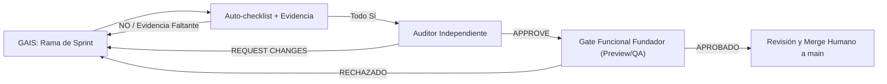

# 🛡️ PLAN DEFINITIVO UNIFICADO — INDUSTRIAL CONTROL 360 (v1.1)
## Guía Canónica de Estabilización, Seguridad, Preview/QA y Fase 2 (S14.2 a S22)
### Repositorio: `wolvesglobalsolutionsgroup-rgb/Industrial-360-App` — Fuente de verdad: `main`

> **NOTA CANÓNICA:** Este es el plan definitivo y unificado para Industrial Control 360. Sustituye todos los documentos y prompts contradictorios previos. Primero se resuelven los bloqueantes de seguridad, aislamiento multi-tenant e idempotencia transaccional (Fundación Obligatoria S14.2 - S14.5); luego se ejecuta el sprint habilitador **S14.6 (Founder Preview/QA Access)** para que el fundador disponga de acceso provisionado server-side y pipeline de Preview; posteriormente se ejecutan los sprints de producto (S15 - S22) sujetos a aprobación funcional del fundador.

---

## 📌 PRINCIPIOS CANÓNICOS OPERATIVOS

| Área | Decisión Definitiva |
|---|---|
| **Fuente de Verdad** | Rama `main` identificada por SHA real del commit. |
| **Desarrollo** | Exclusivamente en ramas `sprint/IC360-SXX-nombre`. Prohibido trabajo directo en `main`. |
| **Preflight** | Verificar primero `git status --short`. Si hay cambios inesperados, detenerse. |
| **Cierre de Sprint** | Cuatro capas obligatorias: (1) Auto-checklist GAIS, (2) Auditoría independiente, (3) Gate Funcional del Fundador en Preview, (4) Merge humano. |
| **Multi-tenant** | `orgId`, `projectId`, `membership` y `role` son obligatorios, sin fallback, validados server-side. |
| **Acceso Fundador** | Provisionamiento server-side de membership en tenant QA/Preview. Sin bypasses en cliente. |
| **Datos Regulatorios** | CCPP, LOTTT, BCV, IGTF, FCIU, Factor K y tarifas son datos versionados; el software no certifica validez legal. |
| **Idempotencia Offline**| Requiere Cloud Function + transacción atómica Admin SDK; UUID cliente por sí solo no basta. |
| **Documentos** | Sellos y QR se emiten server-side; QR no filtra tenant, proyecto, PII o rutas internas. |
| **UI** | Entornos Command Wall 4K, Workstation y Campo; preferencias separadas de `ProjectContext`. |
| **Métricas SaaS** | Solo fuentes backend verificables; sin fuente mostrar `"No disponible"`. |
| **Seguridad** | Sin secretos, PII en logs, hardcodes de tenant ni bypass de Rules/Functions. |

---

## 🔄 FLUJO DE DECISIÓN Y SECUENCIA DE SPRINTS



### 📅 SECUENCIA DEFINITIVA DE SPRINTS

#### 🛡️ FUNDACIÓN OBLIGATORIA (SEGURIDAD Y ARQUITECTURA)
1. **S14.2 — Autoridad Multi-Tenant y RBAC Server-Side:** Org A no puede operar sobre Org B en pruebas negativas.
2. **S14.3 — Outbox e Idempotencia Transaccional:** 100 reintentos de una operación producen exactamente un solo efecto.
3. **S14.4 — Portal Público y Sellos Seguros:** Token rotativo/revocable, rate limit y cero filtración de metadatos.
4. **S14.5 — Supply Chain, CI y Release Gates:** Sin vulnerabilidades High/Critical y CI bloqueante.
5. **S14.6 — Acceso del Fundador a Preview/QA y Catálogo de Validación:** Provisionamiento server-side de membership en tenant QA y pipeline Preview por PR.

#### 🚀 FASE 2 (SPRINTS DE PRODUCTO)
1. **S15 — APU Existente, BC3, Políticas Económicas y Reajustes:** Centralización de `calculateApuUnitCost` y Factor K.
2. **S16 — Personal, HHT, QR Rotativo, SIHO y Política Laboral:** Asistencia append-only y credenciales opacas.
3. **S17 — CHO/CHP, Horómetro, Combustible y Mantenimiento:** Separación de costos de equipos e integración APU.
4. **S18 — BrandKit, Doble Membrete, Firma 1:N y Sello Documental:** Presets tenant-scoped e inmutabilidad.
5. **S19 — DOCX, XLSX, PPTX Editables y PDF Inmutable:** Fórmulas vivas en ExcelJS y exportadores unificados.
6. **S20 — Command Wall 4K, Workstation y Sunlight Field Mode:** Accesibilidad WCAG AAA y visualización adaptativa.
7. **S21 — Sync Center, Conflictos y Recuperación Offline:** UI de estado outbox y máquina de estados de resolución.
8. **S22 — Platform Owner Console, Monetización y Cuotas:** FinOps, auditoría append-only y gestión SaaS.

---

## ⚠️ PROTOCOLO MAESTRO DE EJECUCIÓN PARA GAIS
*(Pegar este bloque antes de cada prompt de sprint)*

```text
⚠️ IC360 — PROTOCOLO MAESTRO DE EJECUCIÓN

Actúa como equipo coordinado:
- Principal Software Engineer
- Firebase / Cloud Functions Security Engineer
- QA Automation Engineer
- Industrial UX Engineer
- Especialista del dominio del sprint

PASO 0 — PREFLIGHT SEGURO
Ejecuta primero: git status --short
Si el árbol contiene cambios inesperados:
- detente inmediatamente;
- no hagas checkout;
- no hagas pull;
- no modifiques archivos;
- reporta los cambios encontrados.

Solo con árbol limpio, ejecuta:
git fetch origin --prune
git checkout main
git pull --ff-only origin main
git rev-parse --short HEAD
git checkout -b sprint/IC360-S<NUMERO>-<nombre>
git status --short

ANTES DE ESCRIBIR CÓDIGO:
1. Lee completamente:
   - AGENTS.md
   - package.json
   - firebase.json
   - firestore.rules
   - storage.rules
   - ADRs y documentación del sprint
   - archivos reales que el sprint pretende modificar
   - pruebas, repositorios, Functions y tipos relacionados
2. Reporta:
   - SHA base auditado;
   - estado limpio del árbol;
   - rama creada;
   - archivos existentes y contratos reales encontrados;
   - archivos que se modificarán;
   - archivos que NO existen;
   - riesgo, migración, compatibilidad y rollback;
   - contradicciones con AGENTS.md o arquitectura real.

REGLAS INMUTABLES:
- Prohibido cambiar, hacer push o merge directo a main.
- Prohibido ejecutar firebase deploy.
- Prohibido usar o reintroducir semax_pino y PROJ-001.
- Prohibido hardcodear orgId, projectId, role, membership, tasas, porcentajes regulatorios, FCIU, BCV, IGTF, CCPP, Factor K, tokens, secretos, URLs productivas, cuotas o métricas ficticias.
- Prohibido poner enlaces firmados temporales, credenciales, tokens, secretos o parámetros sensibles en código, tests, documentación, commits, PRs o logs.
- orgId, projectId, role y membership son obligatorios y se validan server-side. El body del cliente no es una fuente de autoridad.
- Si falta contexto, devolver error explícito. Nunca usar fallback.
- Prohibido introducir any nuevo en dominio, cálculos, repositorios, Functions, exportadores o contratos de seguridad.
- No crear una colección, tipo, motor, contexto, repositorio, exportador o componente paralelo antes de comprobar la implementación existente.
- Toda mutación requiere validación, autorización, auditoría e idempotencia transaccional cuando pueda reintentarse.
- Valores CCPP, LOTTT, BCV, IGTF, Factor K, normas y políticas laborales requieren fuente, vigencia, versión y aprobación humana habilitada. El software los versiona y aplica; no los certifica legalmente.
- No presentar mocks, estimaciones o números sin fuente como datos reales.
- No declarar terminado un sprint si falla una validación o falta evidencia.

VALIDACIONES BASE:
- npm ci
- npm run lint
- npx tsc --noEmit
- npm run test:all
- npm run build
- npm audit --omit=dev --audit-level=high
- npm run audit:no-hardcoded-tenant, solamente si el script existe
- pruebas de Emulator, Functions, E2E, accesibilidad, carga, conflicto o documentos según el sprint

ENTREGA:
- SHA inicial y final;
- archivos modificados;
- decisiones técnicas;
- resultado real de comandos;
- pruebas ejecutadas;
- migración y rollback;
- riesgos abiertos;
- PR recomendado, sin mergear;
- Auto-checklist canónico completo.
```

---

## 🛡️ SPRINTS DE FUNDACIÓN OBLIGATORIA

### 🎯 S14.2 — AUTORIDAD MULTI-TENANT Y RBAC SERVER-SIDE

```text
🎯 S14.2 — AUTORIDAD MULTI-TENANT Y RBAC SERVER-SIDE

Inspecciona primero:
- firestore.rules;
- ensureOwnClaims;
- useAuthClaims;
- ProjectContext;
- memberships;
- repositorios;
- Functions mutantes;
- tests de Rules y Emulator.

Implementa únicamente lo confirmado como necesario:
1. Consolida un autorizador reusable server-side que:
   - exija auth;
   - reciba orgId y projectId obligatorios;
   - consulte membership activa;
   - valide roles permitidos;
   - verifique que el proyecto pertenezca a la organización;
   - rechace inconsistencias entre claims, body y ruta.
2. Refactoriza ensureOwnClaims:
   - roles y orgId proceden solo de membership autoritativa;
   - nunca de documentos editables por cliente;
   - ausencia de membership retorna estado explícito;
   - no revocar refresh tokens innecesariamente.
3. Protege todas las Functions mutantes con el autorizador reusable.
4. Endurece Rules:
   - cliente no crea/edita roles, claims, memberships, sellos, counters, audit logs o approvals;
   - fallback final deny;
   - sin wildcard permisivo.
5. Pruebas obligatorias:
   - Org A vs Org B: get/list/create/update/delete;
   - usuario sin membership;
   - rol bajo intenta escalar privilegio;
   - cliente no emite sello ni portal;
   - perfil editable no altera autorización.

No despliegues. Abre PR sin mergear.
```

---

### 🎯 S14.3 — OUTBOX E IDEMPOTENCIA SERVER-SIDE

```text
🎯 S14.3 — OUTBOX E IDEMPOTENCIA SERVER-SIDE

Inspecciona:
- Dexie schema;
- src/lib/offline;
- outbox;
- syncEngine;
- Functions;
- entidades offline;
- Rules y pruebas existentes.

Implementa una Callable Function syncOutboxMutation tipada con: orgId, projectId, entityType, operationType, operationId UUID v4, entityId opcional, expectedVersion y payload validado.

La Function debe:
1. Validar auth, tenant, proyecto, membership y rol.
2. Restringir entityType y operationType por allow-list.
3. Ejecutar transacción Admin SDK.
4. Consultar idempotency key tenant-scoped.
5. Si existe, devolver duplicate y resultado anterior.
6. Si no existe, validar versión, aplicar mutación, registrar key y audit log en la misma transacción.
7. Rechazar cliente leyendo o escribiendo idempotency keys.

Refactoriza el cliente para usar únicamente esta Function en mutaciones offline críticas.

Conflictos:
- PTW, QA/QC, valuaciones, asistencia, sellos y aprobaciones: bloqueo.
- Evidencia/fotos: append-only.
- Reportes no críticos: conflicto visible y resolución autorizada.

Pruebas:
- 100 retries con mismo operationId crean un efecto;
- corte antes, durante y después del commit;
- respuesta perdida retorna duplicate;
- usuario revocado;
- conflicto entre dos usuarios;
- Org A no alcanza recursos de Org B.

No despliegues. PR sin merge.
```

---

### 🎯 S14.4 — PORTAL PÚBLICO Y SELLOS DOCUMENTALES SEGUROS

```text
🎯 S14.4 — PORTAL PÚBLICO Y SELLOS DOCUMENTALES SEGUROS

Inspecciona portal, sellos, verificadores QR, Functions, logging, CORS, rate limits, Firestore/Storage Rules y pruebas existentes.

Implementa o corrige:
1. Token de portal:
   - 32 bytes criptográficos;
   - persistir hash/HMAC, nunca token plano;
   - comparación en tiempo constante;
   - expiración, rotación y revocación;
   - entrega única del token al creador autorizado.
2. Rate limit:
   - clave por IP normalizada y portalId;
   - no depende de req.user;
   - persiste server-side;
   - 429 + retryAfterSeconds.
3. Portal:
   - no requiere JWT;
   - muestra solo widgets publicados;
   - no filtra orgId, projectId, storagePath, token, PII ni metadata interna;
   - CORS explícito, sin wildcard inseguro.
4. Sello:
   - se emite por Function autorizada;
   - SHA-256 sobre bytes finales;
   - versión append-only;
   - QR a endpoint de verificación mínimo.
5. Audit log:
   - creación, uso, rotación y revocación;
   - nunca loguear token.

Pruebas:
- token ausente, inválido, expirado, revocado y válido;
- rate limit;
- ausencia de token en logs;
- tenant isolation;
- alteración de byte cambia hash.

No despliegues. PR sin merge.
```

---

### 🎯 S14.5 — SUPPLY CHAIN, CI Y RELEASE GATE

```text
🎯 S14.5 — SUPPLY CHAIN, CI Y RELEASE GATE

Inspecciona workflows, package.json, lockfile, scripts y política de release.

Implementa:
1. CI bloqueante:
   - npm ci;
   - lint;
   - tsc;
   - build;
   - tests;
   - Rules/Storage Emulator;
   - Gitleaks;
   - npm audit producción;
   - auditoría de hardcodes;
   - SBOM como artefacto.
2. Crear npm run audit:no-hardcoded-tenant si no existe. Debe detectar al menos:
   - semax_pino;
   - PROJ-001;
   - fallbacks conocidos de orgId/projectId;
   - patrones de secretos prohibidos.
3. No usar continue-on-error en controles de seguridad críticos.
4. Crear:
   - docs/security/CVE_EXCEPTIONS.md;
   - docs/runbooks/RELEASE_GATE.md;
   - plantilla de PR;
   - política de rollback.
5. Configurar Renovate o Dependabot según sea compatible. No modificar dependencias mayores sin ADR y pruebas.

No despliegues. PR sin merge.
```

---

### 🎯 S14.6 — ACCESO DEL FUNDADOR A PREVIEW/QA Y CATÁLOGO DE VALIDACIÓN

```text
🎯 S14.6 — ACCESO DEL FUNDADOR A PREVIEW/QA Y CATÁLOGO DE VALIDACIÓN

CONTEXTO
La autenticación funciona, pero el fundador recibe la pantalla: “Asignación de Membresía Pendiente”. No implementes bypasses, localStorage, roles configurables en cliente, modo demo abierto, allowlists de emails en frontend ni permisos implícitos. El objetivo es que el fundador pueda entrar de forma autorizada a un tenant Preview/QA con datos estrictamente sintéticos, y pueda revisar cada PR antes de que sea aprobado o mergeado.

══════════════════════════════════════════════════════════════
PASO 0 — PREFLIGHT SEGURO
══════════════════════════════════════════════════════════════
1. Ejecuta: git status --short
2. Si hay cambios inesperados:
   - detente;
   - no hagas checkout;
   - no hagas pull;
   - no modifiques archivos;
   - reporta los cambios.
3. Solo con árbol limpio:
   git fetch origin --prune
   git checkout main
   git pull --ff-only origin main
   git rev-parse --short HEAD
   git checkout -b sprint/IC360-S14.6-founder-preview-qa
4. Lee por completo:
   - AGENTS.md;
   - firestore.rules;
   - storage.rules;
   - Functions y ensureOwnClaims;
   - memberships;
   - useAuthClaims;
   - ProjectContext;
   - ProtectedRoute/Auth Gate;
   - Firebase config;
   - Vercel/Firebase Hosting/GitHub Actions existentes;
   - scripts de seed;
   - mecanismos de preview/deploy existentes.
5. Antes de escribir código, reporta:
   - SHA base;
   - archivos reales de autorización;
   - cómo se construyen claims actualmente;
   - cómo se provisionan memberships hoy;
   - plataforma actual de despliegue;
   - si existe preview por PR;
   - configuraciones externas faltantes;
   - plan de migración, riesgo y rollback.

══════════════════════════════════════════════════════════════
REGLAS INMUTABLES
══════════════════════════════════════════════════════════════
- No cambiar directamente main.
- No desplegar producción.
- No crear bypass de autenticación/autorización.
- No otorgar rol desde cliente, localStorage, query string o variables VITE.
- No autorizar por email hardcodeado en frontend o Functions.
- No usar una cuenta productiva para datos QA.
- No copiar datos de producción hacia Preview.
- No incluir secretos, tokens, enlaces firmados, API keys ni URLs con parámetros sensibles en Git, logs, tests, documentación o PR.
- No mostrar datos sintéticos como métricas reales.
- platformAdmin es una identidad independiente de superadmin de tenant.
- Una membership tenant no debe conceder platformAdmin.
- Toda operación administrativa debe ser server-side, auditada y reversible.
- Si falta configuración de Firebase, Vercel o GitHub, documentar el faltante; no inventar IDs de proyecto, URLs, dominios, secretos o tokens.

══════════════════════════════════════════════════════════════
ENTREGA A — PROVISIONAMIENTO SEGURO DEL FUNDADOR EN QA
══════════════════════════════════════════════════════════════
Implementa o extiende un flujo administrativo server-side para provisionar una cuenta autenticada en un tenant QA/Preview.
Requisitos:
1. Tenant QA:
   - organización Preview/QA claramente identificada;
   - datos exclusivamente sintéticos;
   - banner persistente: “PREVIEW / QA — Datos sintéticos — No usar para operación real”;
   - sin acceso, referencias, claves ni rutas a producción.
2. Membership:
   - creada o actualizada solo por Cloud Function/Admin SDK;
   - incluye orgId, rol, estado, createdBy, createdAt, source y audit metadata;
   - exige que el actor sea platformAdmin autorizado o un proceso de bootstrap de una sola ejecución y controlled;
   - evita autoescalamiento de privilegios;
   - es reversible mediante revocación server-side.
3. Claims:
   - derive claims desde membership autoritativa;
   - realiza refresh de token de forma controlada;
   - no invalida sesiones innecesariamente;
   - muestra un estado claro si el refresh aún no ocurrió;
   - nunca usa documento editable por cliente como autoridad.
4. Separación:
   - QA/Preview debe tener Firebase project/config separado de producción cuando la infraestructura existente lo permita;
   - variables públicas Vite no deben contener secretos;
   - Functions, Firestore, Storage y Auth deben apuntar al entorno correcto;
   - no permitir referencias cruzadas entre recursos QA y producción.
5. Bootstrap:
   - no hardcodear email ni UID;
   - documentar un runbook seguro para que un platformAdmin provisionado indique el UID autenticado y el orgId QA mediante mecanismo autorizado;
   - si se requiere configuración externa/manual, documentar exactamente el paso, quién lo ejecuta y cómo se audita.

══════════════════════════════════════════════════════════════
ENTREGA B — PREVIEW AUTOMÁTICO POR PR
══════════════════════════════════════════════════════════════
Implementa el pipeline solo hasta donde la configuración real lo permita.
1. Cada PR elegible debe producir:
   - build verificable;
   - URL Preview efímera o entorno Preview identificado;
   - SHA desplegado;
   - estado del despliegue;
   - enlace en el PR o comentario de CI.
2. Preview usa exclusivamente:
   - Firebase QA;
   - datos QA sintéticos;
   - secretos de CI/configuración externa, nunca versionados;
   - configuración explícita por environment.
3. Si Vercel/Firebase/GitHub no están configurados:
   - no inventes dominio ni token;
   - crea docs/runbooks/PREVIEW_SETUP.md;
   - lista exactamente las variables, integración, permisos y acciones manuales requeridas;
   - deja el workflow preparado, pero seguro e inactivo por defecto si faltan secrets.
4. Impide que un Preview apunte accidentalmente a producción.

══════════════════════════════════════════════════════════════
ENTREGA C — CENTRO DE VALIDACIÓN DE PRODUCTO
══════════════════════════════════════════════════════════════
Crea una pantalla “Centro de Validación de Producto”, visible solo para platformAdmin dentro del entorno QA/Preview.
Cada funcionalidad/sprint debe mostrar:
- módulo;
- sprint;
- estado: EN_DESARROLLO / LISTO_QA / APROBADO / BLOQUEADO;
- SHA y PR;
- URL Preview, si existe;
- entorno: QA / Preview;
- pruebas ejecutadas y resultado;
- riesgos abiertos;
- fecha de actualización y responsable;
- evidencia o enlace interno seguro, sin secretos ni URLs firmadas.

Reglas:
- El catálogo no altera autorizaciones.
- No inventa estados, métricas, pruebas, URLs o resultados.
- Un dato ausente debe mostrar “No disponible” o “Pendiente”.
- La fuente debe ser un manifiesto versionado de release/QA o backend autorizado; no una lista hardcodeada en el componente.
- No expone información de plataforma a usuarios tenant comunes.
- No reescribe PlatformOwnerConsole si ya existe: extiende el sistema real encontrado en el repositorio.

══════════════════════════════════════════════════════════════
ENTREGA D — GATE DE APROBACIÓN VISUAL DEL FUNDADOR
══════════════════════════════════════════════════════════════
Documenta y, si la infraestructura real lo permite, aplica en CI:
Un sprint no puede pasar a “LISTO PARA APROBACIÓN HUMANA” sin:
- PR abierto;
- SHA verificable;
- Preview URL disponible o motivo explícito/documentado de indisponibilidad;
- evidencia de auto-checklist;
- resultados de pruebas;
- validación funcional del fundador registrada como: PENDIENTE / APROBADA / RECHAZADA;
- auditoría técnica independiente.

La aprobación funcional del fundador:
- no sustituye pruebas técnicas;
- no permite saltar P0/P1;
- no genera privilegios adicionales;
- queda registrada con actor, hora y comentario opcional.

══════════════════════════════════════════════════════════════
PRUEBAS OBLIGATORIAS
══════════════════════════════════════════════════════════════
- fundador provisionado server-side entra al tenant QA;
- usuario autenticado sin membership queda bloqueado;
- usuario tenant no obtiene platformAdmin;
- platformAdmin no aparece por documento editable de cliente;
- Preview no lee/escribe producción;
- datos sintéticos aparecen solo en QA/Preview;
- no hay bypass en localStorage, query params, VITE variables ni Rules;
- revocación de membership elimina acceso tras refresh controlado;
- catálogo no se muestra a usuarios tenant;
- URL/estado ausente se presenta como “No disponible”;
- tests Firebase Emulator, Functions y E2E aplicables;
- npm ci;
- npm run lint;
- npx tsc --noEmit;
- npm run test:all;
- npm run build;
- npm audit --omit=dev --audit-level=high;
- npm run audit:no-hardcoded-tenant, solo si el script existe.

══════════════════════════════════════════════════════════════
ENTREGA FINAL
══════════════════════════════════════════════════════════════
No hagas merge ni deploy de producción. Entrega:
- SHA inicial/final;
- rama y PR recomendado;
- archivos modificados;
- ADR de Preview/QA;
- runbook: “Cómo el fundador abre y valida una funcionalidad en Preview”;
- runbook de provisionamiento/revocación QA;
- configuración externa pendiente, si aplica;
- resultados reales de pruebas;
- rollback;
- riesgos abiertos;
- Auto-checklist canónico completo;
- URL Preview real, o explicación verificable de por qué aún no puede existir.
```

---

## 🚀 SPRINTS DE FASE 2 (PRODUCTO E INGENIERÍA)

### 🎯 S15 — EXTENSIÓN DEL MOTOR APU, POLÍTICAS Y REAJUSTE

```text
🎯 S15 — EXTENSIÓN DEL MOTOR APU, POLÍTICAS Y REAJUSTE

Antes de escribir:
- lee completo ApuEstimation;
- lee excelExporter;
- identifica calculateApuUnitCost y todos sus usos;
- revisa parser BC3 existente;
- revisa tests de cálculos y valuaciones.

Implementa:
1. Extraer calculateApuUnitCost a src/lib/engineering/apuCalculator.ts:
   - mantener firma y lógica USD existente;
   - actualizar todos los imports;
   - confirmar con rg que existe una sola definición.
2. Añadir capa separada de reajuste:
   - contratos VES, USD y mixtos;
   - total VES no debe aplicar K indiscriminadamente después de USD->VES;
   - K se aplica al componente contractual definido por política;
   - validar coeficientes y tolerancia de suma;
   - soportar componente local e importado cuando aplique.
3. Modelar EffectivePolicy/Rate: id, kind, value decimal, currency, effectiveFrom, effectiveTo, sourceDocumentId/sourceUrl, approvedBy, approvedAt, version, status.
4. Modelar salario integral/política laboral como datos: nivel ocupacional, condición de trabajo, antigüedad, fondo de ahorro, descanso remunerado, prestaciones, bono vacacional, utilidades y demás campos requeridos por la política aprobada. No convertir tablas sugeridas en constantes normativas sin aprobación humana.
5. IGTF:
   - condicional por tipo de transacción y política vigente;
   - no aplicarlo automáticamente a toda conversión.
6. Si falta o está vencida una tasa/política:
   - bloquear cálculo final;
   - explicar el dato faltante;
   - no inventar fallback.
7. Usar decimal/bigint para dinero y tasas. Sin redondeo intermedio no documentado.

Pruebas:
- golden tests del motor anterior;
- tasa vigente, vencida y ausente;
- K con coeficientes válidos/inválidos;
- IGTF aplicable/no aplicable;
- contratos VES/USD/mixtos;
- precisión, negativos, cero y redondeos;
- una definición de calculateApuUnitCost.

No despliegues. PR sin merge.
```

---

### 🎯 S16 — PERSONAL, HHT, SIHO Y QR ROTATIVO

```text
🎯 S16 — PERSONAL, HHT, SIHO Y QR ROTATIVO

Antes de modificar:
- lee WorkerQrRegistry completo;
- identifica FieldWorker, AttendanceRecord, QR, carnet, outbox y Rules;
- confirma la colección canónica y repositorio real;
- no renombres ni crees collection alternativa sin ADR y migración.

Implementa únicamente brechas confirmadas:
1. Política laboral versionada: jornada, zona horaria, turno, descansos, recargos, vigencia, fuente, versión, aprobación y snapshot.
2. Estado SIHO: apto, apto con restricción, observación, no apto, vencido; fecha de vencimiento y revalidación requerida.
3. QR:
   - credentialId opaco;
   - token firmado, rotativo y de TTL definido por policy;
   - revocación inmediata;
   - sin cédula, nombre, SIHO médico, empresa o secreto reutilizable;
   - validación online server-side;
   - offline con caché autorizada de ventana limitada y estado pendiente.
4. Asistencia:
   - evento idempotente append-only;
   - usuario, dispositivo, hora local, hora servidor, frente de obra y sync state;
   - correcciones con supervisor, reasonCode y audit log.
5. HHT:
   - normal, extra, nocturna normal y extra nocturna cuando policy aplique;
   - métricas total, sin accidentes y sin incapacitantes;
   - excluir o alertar sobre personal no apto/vencido para tareas de riesgo.
6. Accidente:
   - no afirmar envío regulatorio automático sin validación legal;
   - preparar workflow configurable, evidencia y SLA de notificación para responsable de seguridad.

Pruebas:
- QR expirado, revocado, copiado y duplicado;
- duplicado de asistencia no duplica HHT;
- SIHO vencido bloquea/alerta según policy;
- offline y reintento;
- tenant isolation;
- corrección auditada.

No despliegues. PR sin merge.
```

---

### 🎯 S17 — COSTO HORARIO DE EQUIPOS Y MANTENIMIENTO

```text
🎯 S17 — COSTO HORARIO DE EQUIPOS Y MANTENIMIENTO

Antes de modificar:
- confirma archivo real de equipos; no asumas EquipmentRegistry;
- revisa FleetEquipment, Inventory, repositorios y motores existentes;
- identifica propietario de cada dominio.

Implementa:
1. Motor tipado y puro:
   - calculateCHP;
   - calculateCHO;
   - calculateHourlyRate;
   - calculateFuelVariance;
   - calculateMaintenanceDue.
2. CHP: depreciación, capital, seguros, mantenimiento mayor y otros componentes definidos por policy.
3. CHO: combustible, lubricantes, neumáticos/orugas, operador y variables de carga/uso definidas por policy.
4. Datos:
   - horómetro append-only;
   - consumo de combustible con unidad, evidencia y origen;
   - correcciones como eventos de ajuste;
   - moneda, vida útil, residual, horas anuales, seguro y tasas versionadas.
5. Mantenimiento:
   - schedule por activo, fabricante/modelo y criticidad;
   - no alerta global fija de 250h;
   - estados operating, standby e idle si corresponden al catálogo.
6. Integración:
   - operador toma costo laboral desde S15 por referencia/snapshot;
   - APU consume tarifa por contrato tipado, no números duplicados.

Pruebas:
- CHP/CHO separados;
- horas cero, moneda inválida, residual inválido y unidades;
- schedule configurable;
- standby vs operating;
- integración con APU;
- cross-tenant.

No despliegues. PR sin merge.
```

---

### 🎯 S18 — BRANDKIT, DOBLE MEMBRETE Y SELLO SEGURO

```text
🎯 S18 — BRANDKIT, DOBLE MEMBRETE Y SELLO SEGURO

Antes de modificar:
- lee ProjectContext y tipo BrandKit canónico;
- lee Settings y flujos de membrete;
- busca interfaces/exports de BrandKit existentes;
- no crear tipo BrandKit paralelo.

Implementa:
1. Presets tenant-scoped: PDVSA, Chevron, Repsol y ENI como draft configurables. No afirmar certificación, ni usar logos sin autorización.
2. Crear componentes nuevos si no existen:
   - DualHeader;
   - DocumentSeal;
   - DocumentSigner para firmas 1:N.
3. Cada documento conserva: templateVersion, brandKitVersion, documentVersion, sealVersion, locale, timezone y signers.
4. Hora legal:
   - centralizar fecha/hora de documento en política de zona;
   - usar America/Caracas donde el documento/proyecto corresponda;
   - evitar timestamps ambiguos.
5. Sello:
   - emitido solo por Function autorizada;
   - SHA-256 de bytes finales;
   - QR mínimo;
   - VERIFIER_BASE_URL viene de configuración segura;
   - ausencia de configuración debe fallar explícitamente, no usar fallback.
6. Integrar en PTW, QA/QC y valuaciones solo tras confirmar archivos reales.

Pruebas:
- no hay BrandKit duplicado;
- preset draft no se emite como approved;
- QR no filtra datos internos;
- alteración de bytes cambia hash;
- versión de BrandKit queda congelada en documento;
- validación build-time de configuración requerida.

No despliegues. PR sin merge.
```

---

### 🎯 S19 — DOCX, XLSX, PPTX Y PDF INMUTABLE DE CIERRE

```text
🎯 S19 — DOCX, XLSX, PPTX Y PDF INMUTABLE DE CIERRE

Antes de escribir:
1. Lee excelExporter completo.
2. Ejecuta npm ls exceljs docx pptxgenjs.
3. Si docx/pptxgenjs faltan: npm install docx pptxgenjs reporta versiones y lockfile.
4. Si falla la instalación, detente; no inventes imports ni .d.ts.

Implementa:
1. Contrato único DocumentViewModel para DOCX/XLSX/PPTX.
2. DOCX:
   - doble membrete en tabla editable;
   - firmas 1:N;
   - texto, tablas, caracteres acentuados e imágenes.
3. XLSX:
   - extender/reutilizar excelExporter actual;
   - no crear descargador paralelo;
   - fórmulas reales, fuentes y snapshots;
   - IGTF solo cuando policy lo determine;
   - formato VES es-VE;
   - probar que cell.formula es string y no undefined.
4. PPTX:
   - layout 16:9;
   - doble membrete;
   - manejo de títulos, tablas, logos largos y fuente compatible.
5. Cierre:
   - exportables editables son la versión de trabajo;
   - PDF final congelado se sella con SHA-256 y versión documental;
   - no confundir PDF sellado con documento editable.

Pruebas:
- roundtrip/estructura de DOCX, XLSX y PPTX;
- apertura real documentada en Word, Excel, LibreOffice y PowerPoint;
- fórmulas XLSX reales;
- layout PPTX;
- caracteres, unidades, tablas largas, imágenes, firmas y membretes;
- tenant isolation.

No despliegues. PR sin merge.
```

---

### 🎯 S20 — COMMAND WALL 4K, WORKSTATION Y CAMPO

```text
🎯 S20 — COMMAND WALL 4K, WORKSTATION Y CAMPO

Implementa DisplayEnvironmentContext independiente de ProjectContext.

Modos:
1. Command Wall:
   - objetivo 3840x2160;
   - OLED dark;
   - grid operativo sin scroll;
   - degradación a 1920x1080;
   - tokens semánticos;
   - mitigación documentada de burn-in para elementos persistentes.
2. Workstation:
   - alta densidad;
   - tablas virtualizadas;
   - navegación de teclado;
   - columnas persistentes.
3. Field Sunlight:
   - blanco/negro de alto contraste;
   - texto principal con ratio medido;
   - resto de pares relevantes conforme al estándar de accesibilidad definido;
   - botones y targets de 64 CSS px mínimo;
   - foco visible;
   - usable con guantes;
   - modo offline claramente visible.

Implementación:
- no colores arbitrarios en componentes;
- tokens semánticos en index.css;
- states loading/data/empty/error;
- prefers-reduced-motion y prefers-contrast.

Pruebas:
- Playwright y axe;
- teclado, foco, zoom, contraste y lector de pantalla;
- 3840x2160, 1920x1080, 1366x768, 1024x768, 768x1024 y 390x844;
- rendimiento e interacción medibles;
- no afirmar AAA sin evidencia.

No despliegues. PR sin merge.
```

---

### 🎯 S21 — SYNC CENTER Y RESOLUCIÓN DE CONFLICTOS

```text
🎯 S21 — SYNC CENTER Y RESOLUCIÓN DE CONFLICTOS

PRECONDICIÓN: S14.3 está cerrado. La Function transaccional es la única ruta de mutaciones offline críticas.

Antes de implementar:
- inspecciona offlineoutbox, syncEngine, conflictPolicy y Dexie;
- confirma funciones existentes antes de crear otras;
- conserva los contratos y no dupliques cola/idempotencia.

Implementa UI accesible Sync Center con:
- pending;
- syncing;
- synced;
- duplicate;
- conflict-blocked;
- failed;
- denied.

Cada elemento muestra: operationId, entidad, momento, último intento, motivo sanitizado y acción.

Conflictos:
- máquina de estados del dominio, no Last-Write-Wins ciego;
- opciones: mantener local, mantener servidor o combinar manualmente, con diff visible cuando policy lo permita;
- PTW, valuaciones, asistencia, QA/QC, sellos y aprobaciones bloquean.

Resiliencia:
- backoff exponencial con jitter;
- cola sobrevive reinicio;
- Service Worker Background Sync cuando soporte navegador;
- fallback explícito para navegadores sin Background Sync, incluido iOS Safari;
- documentar TTL de operationId y política de conservación.

Pruebas:
- 100 retries => un efecto;
- cierre de navegador;
- red antes/durante/después de commit;
- respuesta perdida;
- conflicto dos usuarios;
- cambio de sesión/membership;
- IndexedDB sin espacio;
- cross-tenant.

No despliegues. PR sin merge.
```

---

### 🎯 S22 — PLATFORM OWNER CONSOLE, FINOPS Y AUDITORÍA

```text
🎯 S22 — PLATFORM OWNER CONSOLE, FINOPS Y AUDITORÍA

Antes de escribir:
- lee PlatformOwnerConsole completo;
- reporta qué ya existe y qué falta;
- prohíbe reescritura masiva si el módulo ya funciona parcialmente;
- inspecciona claims, audit logs, telemetría y Functions.

Implementa solo brechas reales:
1. Identidad:
   - platformAdmin es distinto de superadmin de tenant;
   - backend valida acciones de plataforma;
   - acciones sensibles requieren step-up/MFA.
2. Métricas:
   - backend/agregados;
   - source, collectedAt, range, unit, status, confidence;
   - valores verificados, estimados o no disponibles;
   - nunca calcular métricas globales desde navegador de tenants;
   - mostrar “No disponible” cuando falte fuente.
3. SaaS B2B:
   - MRR, ARR, LTV, CAC, NRR y churn solo cuando exista fuente;
   - costo y consumo por tenant con límites/alertas;
   - alertas de cuota a 80%, crítica a 95%, degradación documentada a 100%.
4. Planes:
   - Plan/Entitlement versionado;
   - período de gracia configurable;
   - aviso anticipado;
   - suspensión reversible;
   - diseño preferente read-only antes de pérdida de acceso a evidencia crítica.
5. Auditoría:
   - append-only, hashPrev/hashActual para cadena verificable;
   - redacción configurable de PII;
   - actor, requestId, motivo y resultado sanitizado;
   - retención según política legal/contractual aprobada, no asumir duración sin revisión.
6. Transparencia:
   - cliente ve su consumo read-only según plan y autorización;
   - no ve datos de otros tenants.

Pruebas:
- tenant admin denegado;
- platformAdmin autorizado;
- métrica sin backend muestra No disponible;
- plan/suspensión/reversión auditados;
- MFA/step-up;
- cadena de auditoría verificable;
- PII redactada;
- aislamiento multi-tenant.

No despliegues. PR sin merge.
```

---

## 🧪 CAPA 1 — AUTO-CHECKLIST CANÓNICO DE CIERRE (GAIS)
*(Pegar al final del prompt de cada sprint)*

```text
🧪 AUTO-CHECKLIST CANÓNICO DE CIERRE — SPRINT S[NN]

No declares el sprint terminado sin responder cada punto con:
- Estado: SÍ / NO / NO APLICA
- Evidencia: archivos, pruebas, comandos y salida real
- Riesgo residual
- Si es NO o NO APLICA: justificación y acción pendiente

1. ¿Se reportaron SHA inicial/final y el trabajo ocurrió exclusivamente en una rama sprint, sin cambio directo a main?
2. ¿Se comprobó git status limpio antes de cambiar de rama y se leyó AGENTS.md?
3. ¿Se inspeccionaron archivos, tipos, Rules, Functions, dependencias y pruebas reales antes de crear o editar código?
4. ¿Se evitó duplicar módulos, motores, tipos, colecciones, repositorios, exportadores o contextos? Incluye rg/grep de fuente única de verdad.
5. ¿orgId, projectId, role y membership son obligatorios, no tienen fallback y se validan server-side?
6. ¿No se agregaron hardcodes, secretos, tokens, PII en logs, URLs productivas, tasas/reglas regulatorias constantes ni datos ficticios de producción?
7. ¿Las mutaciones tienen validación de entrada, autorización, audit log e idempotencia transaccional cuando pueden reintentarse?
8. ¿Las políticas económicas, laborales, normativas o de ingeniería tienen fuente, edición, vigencia, aprobación y snapshot versionado?
9. ¿Se preservó el aislamiento multi-tenant? Muestra prueba positiva y negativa entre dos organizaciones creadas para el test.
10. ¿Pasaron los comandos obligatorios aplicables?
    - npm ci
    - npm run lint
    - npx tsc --noEmit
    - npm run test:all
    - npm run build
    - npm audit --omit=dev --audit-level=high
    - auditoría de hardcodes, solo si el script existe
11. ¿Pasaron las pruebas específicas del sprint: Emulator, Functions, E2E, accesibilidad, carga, conflictos offline o artefactos de documento?
12. ¿Hay migración, compatibilidad, rollback, feature flag/kill switch cuando aplica, ADR y riesgo residual documentados?

RESULTADO:
- READY FOR INDEPENDENT AUDIT  o
- NOT READY — [lista exacta de bloqueantes]
```

### 📋 VALIDACIONES ADICIONALES POR SPRINT

| Sprint | Pregunta Obligatoria Adicional |
|---|---|
| **S14.2** | ¿Org A fue bloqueada en get/list/create/update/delete contra Org B? |
| **S14.3 / S21** | ¿100 reintentos de la misma `operationId` generaron exactamente un efecto remoto? |
| **S14.4** | ¿Token ausente, inválido, vencido y revocado fue rechazado sin filtrar datos? |
| **S14.5** | ¿CI bloquea PR ante secreto, hardcode, vulnerabilidad High/Critical, fallo de tipos o tests? |
| **S14.6** | ¿El fundador provisionado server-side entra al tenant QA y ve el catálogo/Preview sin bypass en cliente? |
| **S15** | ¿Una tasa o policy vencida bloquea el cálculo sin inventar reemplazo? |
| **S16** | ¿QR evita PII, expira, se revoca y no duplica asistencia/HHT? |
| **S17** | ¿CHO/CHP están separados y mantenimiento viene de policy versionada? |
| **S18** | ¿El QR del sello no revela tenant, proyecto, Storage path ni documento? |
| **S19** | ¿DOCX/XLSX/PPTX abren realmente y XLSX conserva fórmulas activas? |
| **S20** | ¿Se probaron 4K, teclado, foco, contraste medido y targets de 64px? |
| **S22** | ¿Una métrica sin fuente backend aparece como “No disponible”? |

---

## 🏛️ CAPA 2 — AUDITORÍA INDEPENDIENTE POST-SPRINT

```text
🏛️ AUDITORÍA EMPÍRICA POST-SPRINT — IC360 S[NN]

No edites archivos. Audita [RAMA/PR] contra main. Confirma:
- SHA base y final;
- AGENTS.md y ADR leídos;
- diff y archivos completos revisados;
- resultados reales de CI y pruebas.

Busca:
- bypass de tenant, proyecto, rol o membership;
- hardcodes, secretos, tokens, PII y mocks engañosos;
- any nuevo injustificado;
- mutaciones sin autorización, auditoría o idempotencia;
- Rules, Storage o Functions debilitadas;
- colecciones, motores, tipos o exportadores duplicados;
- políticas económicas/normativas sin vigencia, fuente o aprobación;
- regresiones offline, accesibilidad, rendimiento o documentos;
- vulnerabilidades de producción;
- enlaces firmados, credenciales temporales o parámetros secretos en Git.

Entrega:
1. SHA y alcance auditado.
2. Hallazgos P0/P1/P2/P3 con archivo, evidencia, impacto y corrección.
3. Pruebas cubiertas, no cubiertas y faltantes.
4. Riesgo residual y rollback.
5. Veredicto único:
   - APPROVE
   - APPROVE WITH CONDITIONS
   - REQUEST CHANGES

No apruebes si existe P0/P1, evidencia faltante, fallo de CI o condición que afecte seguridad, tenant, datos, pruebas, migración o rollback.
```

---

## 👁️ CAPA 3 — GATE FUNCIONAL DEL FUNDADOR (PREVIEW / QA)

Para todo PR de producto (a partir de S14.6):

```text
GATE FUNCIONAL DEL FUNDADOR
1. Existe URL Preview asociada al SHA del PR.
2. El fundador puede autenticarse en el entorno QA/Preview con membership server-side activa.
3. El catálogo de QA muestra alcance, pruebas, riesgos y estado real.
4. El fundador marca la validación como APROBADA o RECHAZADA.
5. Si está RECHAZADA, o no existe Preview sin excepción documentada, no hay merge.
```

---

## 👤 CAPA 4 — DECISIÓN Y MERGE HUMANO (FREDDY)

Antes de hacer merge a `main`, confirma las 7 preguntas:

1. ¿SHA inicial/final y rama del PR son verificables?
2. ¿Todos los comandos exigidos están verdes con evidencia real?
3. ¿Existe algún NO, NO APLICA, riesgo abierto o prueba omitida?
4. ¿El auditor emitió `APPROVE` y no existen P0/P1?
5. ¿El fundador ha probado en Preview/QA y marcado la validación como APROBADA?
6. ¿El PR no contiene secretos, hardcodes, enlaces firmados ni cambios ajenos?
7. ¿`main` permanece intacta y el merge será realizado por un humano?

---

## 🚦 REGLA DE AVANCE

| Situación | Acción |
|---|---|
| Auto-checklist completo, todo "Sí" y evidencia verde | Enviar a auditoría independiente |
| Auto-checklist con "No" o evidencia insuficiente | Corregir; no auditar ni mergear |
| Auditoría `APPROVE` | Enviar a Gate Funcional del Fundador en Preview/QA |
| Gate Funcional `APROBADA` | Revisión humana y merge humano a `main` |
| Gate Funcional `RECHAZADA` | Devolver a GAIS; no merge |
| `APPROVE WITH CONDITIONS` | Corregir antes de merge, salvo P3 documental aceptado |
| `REQUEST CHANGES` | Devolver a GAIS; no merge |
| P0/P1, prueba omitida, evidencia falsa o secreto | Sprint bloqueado |
