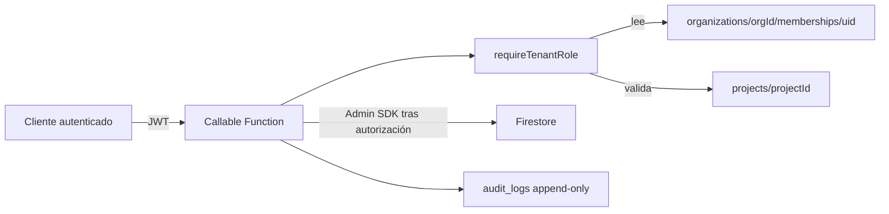

# Plan de ejecución 100/100 — Industrial Control 360

**Rol:** Ingeniería Principal Senior — Seguridad, arquitectura serverless, integridad de datos, calidad y entrega industrial.  
**Fuente de verdad auditada:** `wolvesglobalsolutionsgroup-rgb/Industrial-360-App`, `main @ 7003fa1`.  
**Fecha:** 2026-07-31.  
**Regla de ejecución:** antes de cambiar cualquier archivo, ejecutar `git pull origin main`, leer el `AGENTS.md` raíz y registrar la decisión en `DECISIONS.md`.

> **Regla inmutable de contexto.** Está prohibido introducir valores de tenant o proyecto de ejemplo, valores por defecto, recuperaciones silenciosas o IDs embebidos. Todo `orgId` y `projectId` debe provenir del JWT verificado, `useAuthClaims` y `ProjectContext`; si no existe, la operación debe terminar con un error explícito.

---

## 0. Diagnóstico empírico y decisión de salida

La calificación actual no puede ser 100/100. La siguiente tabla contiene hallazgos comprobados en el código de `main`, no supuestos.

| ID | Severidad | Evidencia | Riesgo | Corrección obligatoria |
|---|---|---|---|---|
| SEC-001 | P0 | `ensureOwnClaims` toma `orgId` y `role` de `/users/{uid}`; el perfil aún puede ser creado por el cliente con un `orgId` arbitrario. | Un usuario puede obtener un claim de otra organización y leer su árbol Firestore. | La membresía, escrita solo por Admin SDK, será la única fuente de `orgId`/`role`; se prohíbe el alta de `/users` desde cliente. |
| SEC-002 | P0 | `createClientPortal` y `sealDocument` validan organización, pero no exigen un rol de negocio autorizado ni validan el proyecto solicitado. | Un usuario de bajo privilegio puede emitir portales/sellos en su propio tenant. | Middleware callable único `requireTenantRole`; autorizar roles, organización y proyecto en servidor. |
| OFF-001 | P1 | `syncEngine.ts` lee/escribe `/idempotency_keys`, mientras las reglas Firestore terminan en deny-all. | La cola puede escribir el documento y fallar al marcar idempotencia; reintentos y duplicados. | La mutación y la idempotencia deben ocurrir en una Cloud Function con transacción Admin SDK. |
| API-001 | P1 | `getClientPortal` usa `rateLimit`, que exige `req.user.uid`, aunque el endpoint es público. | El portal se bloquea con 401 antes de validar su token. | Limiter público independiente por IP + portalId, sin JWT. |
| SUP-001 | P1 | `npm audit --omit=dev` reportó 4 críticas y 22 altas. `tokml` y cadenas de `exceljs` son relevantes. | No se cumple cero vulnerabilidades críticas. | Eliminar/reemplazar paquetes sin ruta de corrección, actualizar lockfile y bloquear CI. |
| QUAL-001 | P1 | Uso abundante de `any` en Functions, repositorios, offline y normas. | Los límites de autorización y datos de ingeniería no tienen garantías estáticas. | Activar `strict`, introducir DTOs y prohibir `any` nuevo. |
| PERF-001 | P2 | No hay benchmark reproducible de 50k WBS, 100k juntas o 10k ILI. | La meta de 60 FPS no está demostrada. | Dataset sintético, pruebas de carga y presupuestos medidos. |

### Criterio de salida global

Solo se declara **100/100** cuando todas las condiciones se cumplen en CI y staging: cero P0/P1 abiertos; pruebas de reglas, Functions, integración y E2E verdes; `npm audit --omit=dev --audit-level=high` sin hallazgos; cobertura acordada de ramas críticas >= 90%; pruebas de aislamiento de tenant negativas y positivas; SLOs de rendimiento publicados; y revisión humana de normas/reglas de ingeniería firmada por el responsable técnico habilitado.

---

## 1. Preflight obligatorio para cada sprint

Ejecutar y pegar la salida en el PR. Si un comando falla, no se desarrolla sobre esa copia.

```powershell
git checkout main
git pull origin main
git rev-parse --short HEAD
Get-Content -Raw AGENTS.md
npm ci
npm run lint
npm run test:all
npm audit --omit=dev --audit-level=high
```

Reglas de trabajo:

1. Crear una rama `sprint/S14-2-tenant-authority` (o el sprint correspondiente); ningún cambio directo a `main`.
2. Un PR equivale a una unidad de riesgo: código, pruebas, migración, telemetría y documentación juntos.
3. Nunca exponer PAT, API keys, tokens de portales ni secretos en código, documentación, issue, prompt o salida de CI. Usar Secret Manager y credenciales de corta duración/mínimo privilegio.
4. Todo endpoint mutante aplica validación de esquema, autorización server-side, idempotencia y audit log.

---

## 2. Sprint S14.2 — Autoridad de tenant y RBAC server-side

### Objetivo

Eliminar SEC-001 y SEC-002: la membership autoritativa determina las claims y todos los callables comprueban organización, rol y proyecto antes de usar Admin SDK.

### Diseño



### Código exacto: `functions/src/authz.ts` (archivo nuevo)

```ts
import * as functions from 'firebase-functions';
import { FieldPath, getFirestore } from 'firebase-admin/firestore';

export const ROLES = ['superadmin', 'gerente', 'coordinador', 'inspector', 'campo', 'cliente'] as const;
export type Role = (typeof ROLES)[number];

type AuthContext = functions.https.CallableContext;

export interface TenantScope {
  uid: string;
  orgId: string;
  role: Role;
}

function isRole(value: unknown): value is Role {
  return typeof value === 'string' && (ROLES as readonly string[]).includes(value);
}

export async function requireTenantRole(
  context: AuthContext,
  requestedOrgId: unknown,
  allowedRoles: readonly Role[],
  requestedProjectId?: unknown,
): Promise<TenantScope> {
  if (!context.auth) {
    throw new functions.https.HttpsError('unauthenticated', 'Autenticación requerida.');
  }
  if (typeof requestedOrgId !== 'string' || requestedOrgId.trim().length === 0) {
    throw new functions.https.HttpsError('invalid-argument', 'orgId es obligatorio.');
  }
  if (requestedProjectId !== undefined &&
      (typeof requestedProjectId !== 'string' || requestedProjectId.trim().length === 0)) {
    throw new functions.https.HttpsError('invalid-argument', 'projectId es obligatorio cuando la operación es de proyecto.');
  }

  const uid = context.auth.uid;
  const orgId = requestedOrgId.trim();
  const db = getFirestore();
  const membership = await db.doc(`organizations/${orgId}/memberships/${uid}`).get();
  const data = membership.data();

  if (!membership.exists || !data || !['active', 'approved', 'aprobado'].includes(data.status)) {
    throw new functions.https.HttpsError('permission-denied', 'No existe una membresía activa para esta organización.');
  }
  if (!isRole(data.role) || !allowedRoles.includes(data.role)) {
    throw new functions.https.HttpsError('permission-denied', 'El rol no está autorizado para esta operación.');
  }

  if (typeof requestedProjectId === 'string') {
    const project = await db.doc(`organizations/${orgId}/projects/${requestedProjectId}`).get();
    if (!project.exists || project.data()?.orgId !== orgId) {
      throw new functions.https.HttpsError('permission-denied', 'El proyecto no pertenece a la organización autorizada.');
    }
  }

  return { uid, orgId, role: data.role };
}

export async function getAuthoritativeMembership(uid: string): Promise<TenantScope> {
  const snapshot = await getFirestore()
    .collectionGroup('memberships')
    .where(FieldPath.documentId(), '==', uid)
    .get();

  const matches = snapshot.docs
    .map((doc) => ({ doc, data: doc.data() }))
    .filter(({ data }) => ['active', 'approved', 'aprobado'].includes(data.status) && isRole(data.role));

  if (matches.length !== 1) {
    throw new functions.https.HttpsError(
      'failed-precondition',
      'El usuario debe tener exactamente una membresía activa antes de emitir claims.',
    );
  }

  const match = matches[0];
  const orgId = match.doc.ref.parent.parent?.id;
  if (!orgId) throw new functions.https.HttpsError('internal', 'Ruta de membership inválida.');
  return { uid, orgId, role: match.data.role };
}
```

> Nota de implementación: si el producto soporta varias organizaciones activas por usuario, no se debe elegir una implícitamente. Implementar `switchActiveOrganization(orgId)` con la misma comprobación de membership y renovar claims; el cliente nunca selecciona una organización solo por un valor almacenado localmente.

### Código exacto: reemplazo de `ensureOwnClaims` en `functions/src/index.ts`

```ts
import { getAuthoritativeMembership, requireTenantRole, ROLES, Role } from './authz';

export const ensureOwnClaims = functions.https.onCall(async (_data: unknown, context: functions.https.CallableContext) => {
  if (!context.auth) {
    throw new functions.https.HttpsError('unauthenticated', 'El usuario debe estar autenticado.');
  }
  const scope = await getAuthoritativeMembership(context.auth.uid);
  await getAuth().setCustomUserClaims(scope.uid, { orgId: scope.orgId, role: scope.role });
  await getAuth().revokeRefreshTokens(scope.uid);
  return { success: true, orgId: scope.orgId, role: scope.role };
});
```

### Código exacto: aprovisionamiento administrativo de membresía y perfil

El primer `superadmin` se crea mediante una operación administrativa controlada y registrada (runbook de despliegue); a partir de entonces el siguiente callable es el único camino de aprovisionamiento. No existe un registro abierto de usuario que elija organización o rol.

```ts
interface ProvisionUserInput {
  uid: string;
  orgId: string;
  role: Role;
  displayName: string;
}

function parseProvisionUser(data: unknown): ProvisionUserInput {
  if (!data || typeof data !== 'object') throw new functions.https.HttpsError('invalid-argument', 'Payload inválido.');
  const value = data as Record<string, unknown>;
  if (typeof value.uid !== 'string' || !value.uid.trim() ||
      typeof value.orgId !== 'string' || !value.orgId.trim() ||
      typeof value.displayName !== 'string' || !value.displayName.trim() ||
      !ROLES.includes(value.role as Role)) {
    throw new functions.https.HttpsError('invalid-argument', 'uid, orgId, displayName y role válido son obligatorios.');
  }
  return { uid: value.uid.trim(), orgId: value.orgId.trim(), displayName: value.displayName.trim(), role: value.role as Role };
}

export const provisionUser = functions.https.onCall(async (data: unknown, context: functions.https.CallableContext) => {
  const input = parseProvisionUser(data);
  const actor = await requireTenantRole(context, input.orgId, ['superadmin']);
  const db = getFirestore();
  const batch = db.batch();
  batch.set(db.doc(`organizations/${actor.orgId}/memberships/${input.uid}`), {
    uid: input.uid, orgId: actor.orgId, role: input.role, status: 'active',
    createdAt: FieldValue.serverTimestamp(), createdBy: actor.uid,
  });
  batch.set(db.doc(`users/${input.uid}`), {
    displayName: input.displayName, orgId: actor.orgId, role: input.role,
    createdAt: FieldValue.serverTimestamp(), createdBy: actor.uid,
  }, { merge: true });
  batch.set(db.collection(`organizations/${actor.orgId}/audit_logs`).doc(), {
    action: 'USER_PROVISIONED', actorUid: actor.uid, subjectUid: input.uid,
    role: input.role, timestamp: FieldValue.serverTimestamp(),
  });
  await batch.commit();
  await getAuth().setCustomUserClaims(input.uid, { orgId: actor.orgId, role: input.role });
  await getAuth().revokeRefreshTokens(input.uid);
  return { success: true, uid: input.uid, orgId: actor.orgId, role: input.role };
});
```

### Código exacto: patrón obligatorio de callable mutante

```ts
export const createClientPortal = functions.https.onCall(async (data: unknown, context: functions.https.CallableContext) => {
  const input = parseCreateClientPortal(data); // Zod/validador estricto; rechaza campos desconocidos.
  const scope = await requireTenantRole(context, input.orgId, ['superadmin', 'gerente', 'coordinador'], input.projectId);
  // Solo después de requireTenantRole puede usarse Admin SDK.
  // El orgId usado en rutas es scope.orgId, nunca un valor alterno del body.
  return createPortalAuthorized(scope, input);
});
```

### Reglas Firestore: cambio exacto para perfiles

Sustituir el bloque `match /users/{userId}` por el siguiente. El aprovisionamiento se hace exclusivamente desde Cloud Functions/Admin SDK.

```firestore
match /users/{userId} {
  allow read: if isAuthenticated() && (request.auth.uid == userId || isSuperAdmin());
  allow create: if false;
  allow update: if isAuthenticated() && request.auth.uid == userId
    && !request.resource.data.diff(resource.data).affectedKeys()
      .hasAny(['role', 'orgId', 'approvedBy', 'createdBy', 'claims']);
  allow delete: if false;
}
```

### Pruebas y aceptación

- Un usuario sin membership activa recibe `permission-denied` al llamar `ensureOwnClaims`.
- Una membership activa de `orgA` nunca permite leer, crear portal, sellar documento ni escribir en `orgB`.
- `campo` y `cliente` no pueden crear portales ni sellos.
- Las pruebas deben crear organizaciones aleatorias (`crypto.randomUUID()`); no usar IDs de ejemplo prohibidos.
- Cobertura de ramas de `authz.ts` >= 95%.

---

## 3. Sprint S14.3 — Outbox transaccional e idempotencia server-side

### Objetivo

Eliminar la escritura directa del cliente en `idempotency_keys` y garantizar que mutación, marca de idempotencia y log ocurran atómicamente.

### Contrato de la API

```ts
export interface SyncMutationInput {
  orgId: string;
  projectId: string;
  collectionName: 'field_reports' | 'valuations' | 'routes';
  operationId: string; // UUID v4 validado
  operationType: 'create' | 'update' | 'delete';
  docId?: string;
  payload: Record<string, unknown>;
}
```

### Implementación obligatoria

1. Crear callable `syncOutboxMutation`.
2. Validar el esquema, el UUID, la colección mediante allow-list y el rol con `requireTenantRole`.
3. En `runTransaction`, leer la clave bajo `organizations/{orgId}/idempotency_keys/{operationId}`. Si existe, devolver el resultado previo; si no, escribir documento, clave y auditoría.
4. Reemplazar en `syncEngine.ts` las llamadas `getDoc/setDoc` de `idempotency_keys` por `httpsCallable(functions, 'syncOutboxMutation')`.
5. Mantener el elemento de Dexie hasta recibir `success` o `duplicate`; nunca eliminarlo tras un error de red.

### Código central exacto de la transacción

```ts
const keyRef = db.doc(`organizations/${scope.orgId}/idempotency_keys/${input.operationId}`);
const documentRef = input.docId
  ? db.doc(`organizations/${scope.orgId}/projects/${input.projectId}/${input.collectionName}/${input.docId}`)
  : db.collection(`organizations/${scope.orgId}/projects/${input.projectId}/${input.collectionName}`).doc();

const result = await db.runTransaction(async (tx) => {
  const existing = await tx.get(keyRef);
  if (existing.exists) return { duplicate: true, documentId: existing.data()?.documentId as string };

  if (input.operationType === 'delete') {
    tx.update(documentRef, { _deleted: true, _deletedAt: FieldValue.serverTimestamp() });
  } else if (input.operationType === 'update') {
    tx.update(documentRef, { ...sanitizedPayload, updatedAt: FieldValue.serverTimestamp() });
  } else {
    tx.create(documentRef, { ...sanitizedPayload, orgId: scope.orgId, projectId: input.projectId, createdAt: FieldValue.serverTimestamp(), createdBy: scope.uid });
  }
  tx.create(keyRef, { operationId: input.operationId, documentId: documentRef.id, createdAt: FieldValue.serverTimestamp(), createdBy: scope.uid });
  return { duplicate: false, documentId: documentRef.id };
});
```

### Aceptación

- Repetir la misma mutación 100 veces devuelve un solo documento y 99 resultados `duplicate`.
- Cortar conexión antes/después de la respuesta no genera documentos duplicados.
- Una clave de `orgA` no puede afectar `orgB`.
- La cola conserva orden por agregado de dominio y pausa ante conflictos bloqueantes.

---

## 4. Sprint S14.4 — Portal público funcional y seguro

1. Sustituir el limitador actual del portal por `rateLimitPublic(ip, portalId, 30)`. La clave debe ser `sha256(ip + ':' + portalId + ':' + window)` y nunca almacenar el token crudo.
2. Restringir CORS a los orígenes configurados en `ALLOWED_PORTAL_ORIGINS`; durante desarrollo permitir únicamente `localhost` configurado explícitamente. No usar `*` para endpoints que acepten credenciales.
3. Usar `crypto.timingSafeEqual` (ya incorporado) y rechazar hashes de longitud distinta antes de comparar.
4. Aplicar tamaño máximo de body, validación de método, cabeceras CSP/Referrer-Policy y no incluir `orgId` o metadatos sensibles salvo que formen parte del alcance publicado.
5. Implementar revocación, rotación de token, expiración y auditoría con retención definida.

**Aceptación:** token válido 200; token inválido/expirado/revocado 401/403; petición 31 en ventana recibe 429; el portal no requiere JWT; ningún token aparece en logs.

---

## 5. Sprint S14.5 — Cadena de suministro y CI bloqueante

1. Generar SBOM CycloneDX y adjuntarlo a cada release.
2. Retirar `tokml` o reemplazarlo por un parser/exportador mantenido. No aceptar un paquete crítico sin remediation.
3. Actualizar `react-router-dom`, Vite, Express, Firebase y las dependencias transitivas usando cambios pequeños, con tests tras cada lote.
4. No ejecutar `npm audit fix --force` sin revisión de diff/compatibilidad.
5. El pipeline debe ejecutar: `npm ci` → lint → unit → rules emulator → Functions integration → build → audit production → secret scan → SBOM.

**Gate de CI obligatorio:** `npm audit --omit=dev --audit-level=high` debe salir 0. Si existe una excepción temporal, debe tener issue, propietario, fecha de caducidad y mitigación; ninguna excepción aplica a crítica explotable en producción.

---

## 6. Sprint S15 — Tipos, contratos y normativa verificable

1. Reemplazar `any` nuevo por `unknown` y validadores de entrada. Añadir regla ESLint `@typescript-eslint/no-explicit-any: error` con una lista de excepciones temporal y decreciente.
2. Definir DTOs versionados para Functions, Firestore y exportadores; validar datos externos con Zod antes de persistir o calcular.
3. Para cada calculadora, declarar unidades, rango permitido, edición/sección normativa, método de redondeo y tests de frontera.
4. Cada resultado de ingeniería debe mostrarse como **apoyo al ingeniero**, con entradas, fórmula, edición normativa y trazabilidad; no emitir certificación automática.
5. Crear un registro de decisiones en `DECISIONS.md` para cada librería, norma, fórmula o cambio de seguridad.

**Aceptación:** `tsc --noEmit` y tests verdes; no existen `any` nuevos; cada fórmula crítica dispone de vector de prueba revisado por ingeniería.

---

## 7. Sprint S16 — UX industrial, accesibilidad y rendimiento medido

1. Añadir Playwright: flujos autenticados, estados carga/datos/vacío/error, teclado, lector de pantalla y viewport de campo, workstation y 4K.
2. Medir con dataset determinista: 50,000 WBS, 100,000 juntas y 10,000 ILI. Guardar generador y resultados en `tests/performance/`.
3. Virtualizar filas y columnas; paginar/consultar por cursor; prohibir cargas masivas de Firestore al navegador.
4. Fijar presupuestos: interacción p95 < 100 ms, render de lista virtualizada p95 < 16.7 ms en workstation de referencia, error budget y memoria documentados.
5. Verificar targets táctiles de 64px y contraste AAA en modo sol, tal como define `AGENTS.md`.

---

## 8. Secuencia de PRs y criterios de aprobación

| PR | Dependencia | No mezclar con | Aprobación necesaria |
|---|---|---|---|
| S14.2 | Ninguna | UI/funcionalidades | Seguridad + pruebas de reglas/Functions |
| S14.3 | S14.2 | Migraciones de UI | Seguridad + prueba de fallos de red |
| S14.4 | S14.2 | Cambios cosméticos | Seguridad + pruebas HTTP |
| S14.5 | Ninguna | Refactors grandes | Dependencias + CI verde |
| S15 | S14.2/S14.3 | Sprints comerciales | Ingeniería + QA |
| S16 | S15 | — | UX, rendimiento y accesibilidad |

Cada PR debe incluir: amenaza mitigada, decisiones, migración/rollback, prueba positiva, prueba negativa, evidencia CI y lista de archivos tocados.

---

## 9. Prompts ejecutables para GAIS y Consejo de Ingeniería

### 9.1 Prompt maestro para Google AI Studio

```text
Actúa como un equipo senior coordinado (Principal Engineer, Security Engineer, Firebase/Cloud Functions Engineer, QA Automation Engineer y UX Industrial Engineer) para Industrial Control 360.

REGLA DE SINCRONIZACIÓN INMUTABLE:
1. Ejecuta `git checkout main && git pull origin main`.
2. Informa el SHA exacto de `git rev-parse --short HEAD`.
3. Lee y adopta íntegramente `AGENTS.md` en la raíz.
4. Si no puedes confirmar los pasos 1–3, DETENTE: no generes ni modifiques archivos.

REGLAS INMUTABLES DE TENANT:
- Prohibido introducir IDs de organizaciones/proyectos de ejemplo, fallbacks o valores hardcodeados.
- orgId y projectId son obligatorios y proceden de JWT verificado, useAuthClaims y ProjectContext.
- Si falta contexto, devuelve un error explícito; jamás selecciones ni inventes un tenant.
- Nunca aceptes orgId, role o permisos del body como autoridad. Revalídalos mediante membership server-side.
- No escribas secretos, tokens, claves ni valores de entorno en el repositorio, documentación o logs.

SPRINT A EJECUTAR: [PEGAR SPRINT Y OBJETIVO]
ANTES DE CODIFICAR: inspecciona archivos reales, enumera impacto, diseña contrato tipado y plan de pruebas.
IMPLEMENTACIÓN: produce cambios mínimos, completos y tipados; añade pruebas positivas/negativas, migración y rollback. No mocks en rutas de producción.
VALIDACIÓN OBLIGATORIA: npm run lint; npm run test:all; npm run build; npm audit --omit=dev --audit-level=high.
ENTREGA: SHA inicial/final, archivos modificados, código, pruebas, salida de validación, riesgos restantes y siguiente PR recomendado. No declares terminado si una validación falla.
```

### 9.2 Prompt de auditoría posterior a cada PR

```text
Audita el PR [URL/RAMA] contra main como Principal Security and Architecture Reviewer. Primero confirma git pull y SHA, luego lee AGENTS.md. Revisa el diff y archivos completos. Busca específicamente bypass de tenant, aceptación de orgId/role desde cliente, secretos, fallback silencioso, any nuevo, paths Firestore no autorizados, fallas de idempotencia, regresiones de accesibilidad y dependencias vulnerables. Ejecuta o solicita evidencia de lint, tests, build y npm audit production. Entrega solo hallazgos reproducibles con severidad, archivo/línea, explotación, corrección exacta y veredicto APPROVE / REQUEST CHANGES. No apruebes si hay P0/P1.
```

### 9.3 Prompt de aprobación de sprint

```text
Como Engineering Manager y Principal Engineer, evalúa el Sprint [ID]. Confirma que la rama está sincronizada con main y que AGENTS.md fue aplicado. Contrasta cada criterio de aceptación contra evidencia verificable: PRs, tests, logs CI, revisión de reglas y prueba negativa de tenant. Devuelve una matriz requisito/evidencia/estado, riesgos abiertos, rollback probado y una decisión: APROBADO, APROBADO CON CONDICIONES o RECHAZADO. La ausencia de evidencia es fallo, no aprobación implícita.
```

### 9.4 Prompt de planificación del próximo sprint

```text
Planifica el próximo sprint para Industrial Control 360 a partir del estado real de main y de los hallazgos abiertos. Ejecuta git pull, informa SHA y lee AGENTS.md antes de proponer trabajo. Prioriza P0, P1, seguridad, integridad de datos y pruebas antes de funcionalidades. Entrega: objetivo único, no-objetivos, arquitectura, contratos tipados, riesgos, archivos previstos, plan de migración/rollback, casos de prueba y criterios de aceptación medibles. Prohíbe datos hardcodeados, mocks de producción y secretos.
```

### 9.5 Prompt de validación de una nueva idea

```text
Evalúa esta idea para Industrial Control 360: [IDEA]. Parte del repositorio real sincronizado y AGENTS.md. Analiza valor operativo, usuarios/roles, aislamiento multi-tenant, modelo de datos, impacto offline, cumplimiento normativo, costo Firebase/Vercel, amenazas, UX en campo/workstation/4K, exportabilidad editable, observabilidad, rendimiento y plan de rollback. Propón un ADR y solo después un sprint mínimo. No inventes datos ni asumas un tenant; indica qué decisiones del fundador faltan.
```

### 9.6 Prompt de incorporación de funcionalidad

```text
Implementa la funcionalidad [NOMBRE] en una rama de sprint para Industrial Control 360. Antes: git pull, SHA, AGENTS.md y lectura de los módulos afectados. Diseña primero un contrato tipado, autorización server-side y persistencia multi-tenant bajo organizations/{orgId}/projects/{projectId}. Toda operación offline debe usar el outbox server-side idempotente. Implementa los cuatro estados UX, accesibilidad, exportaciones cuando correspondan, telemetry y pruebas unitarias/reglas/integración/E2E. No hardcodees organización/proyecto, no agregues secretos, no uses any nuevo y no declares terminado sin evidencia de CI.
```

---

## 10. Checklist final de 100/100

- [ ] No existe ruta por la que el cliente pueda asignar o cambiar `orgId`/`role` autoritativos.
- [ ] Toda Function mutante usa autorización server-side por membership, rol y proyecto.
- [ ] No hay escrituras directas del cliente a claves de idempotencia, auditoría o entidades administrativas.
- [ ] Portal público tiene limitador por IP/portal, CORS configurado, rotación/revocación y ningún token en logs.
- [ ] `npm audit --omit=dev --audit-level=high` pasa, SBOM publicado y secretos escaneados.
- [ ] TypeScript estricto, cero `any` nuevo y contratos validados en límites de confianza.
- [ ] Reglas Firestore/Storage y Functions tienen pruebas de aislamiento negativas entre dos tenants generados al vuelo.
- [ ] Dataset de estrés y resultados reproducibles cumplen el presupuesto de rendimiento.
- [ ] UX verifica carga/datos/vacío/error, teclado, contraste y tres entornos visuales.
- [ ] Ingeniería responsable valida formalmente las fórmulas y ediciones normativas antes de uso operativo.
